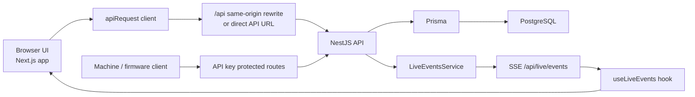

# Pill Count UI

Professional operations console for a pill counting and pharmacy inventory platform. The active application is a monorepo with a Next.js web console in `apps/web`, a NestJS API in `apps/api`, shared schemas in `packages/shared`, and reusable UI primitives in `packages/ui`.

This README explains:

- what each tab in the UI is for
- how the frontend, API, database, and live updates are wired together
- how to run the project locally
- which parts are production-ready and which parts are placeholders

## What The Product Does

The system is designed to manage the operational side of pill counting:

- authenticate pharmacy or warehouse staff
- register and monitor pill counting machines
- create and complete counting jobs
- track stock by pill, lot, expiry, and location
- enforce FEFO-style dispensing behavior
- keep an audit trail of write operations
- stream live operational events back into the dashboard

There are two main actors:

1. Human operators using the web console
2. Machines sending registration, heartbeat, and counting events to the API

## UI Tabs Explained

The main navigation is defined in the dashboard app shell and is the best source of truth for the current UI.

| Tab | Purpose | Current behavior |
| --- | --- | --- |
| `Overview` | Executive snapshot of the operation | Shows KPI cards, latest jobs, recent machine events, and a fleet snapshot. Also exposes quick CSV export and manual refresh. |
| `Jobs / Sessions` | Manage counting work | Create jobs, assign machine and pill type, then start, complete, or recount jobs. Job completion checks actual quantity against the configured tolerance. |
| `Inventory` | Operate the stock ledger | Supports receive, transfer, adjust, reserve, release, and dispense actions. Displays current balances and full movement history. Export is available for inventory movements. |
| `Lots & Expiry` | Lot control and FEFO readiness | Create lots, see expiry exposure, quarantine or release lots, and view the FEFO priority queue sorted by soonest expiry. |
| `Machines Fleet` | Machine monitoring and event inspection | Lists registered machines with computed online/offline state, firmware, last heartbeat, and a searchable machine event viewer with payload inspection. |
| `Reports` | Analytics and exports | Aggregates throughput, inventory valuation by location, and overview metrics. Supports CSV exports for jobs and inventory movement data. |
| `Users & Roles` | RBAC administration | Shows user directory, current role assignments, and the role/permission matrix. Role assignment is currently done through a direct role ID prompt workflow. |
| `Admin` | Direct database editor | ADMIN-only low-level editor that reads Prisma model metadata and lets an admin create, update, or delete live rows directly. It intentionally bypasses normal business workflows. |
| `Settings` | Operational configuration | The live part today is API key management for machine/API clients. Webhook rules and tolerance profile panels are informational placeholders for a later phase. |
| `Audit Log` | Traceability and compliance | Displays the append-only audit records for successful write operations, including actor type, action, resource, and IP metadata. |
| `Maintenance` | Planned feature | Present in navigation but disabled. Intended for maintenance scheduling and service workflows. |
| `Notifications` | Planned feature | Present in navigation but disabled. Intended for alert routing and notification management. |

### Authentication Screens

There is also an auth area outside the dashboard shell:

- `Login`: signs an existing user in
- `Register`: creates a new user and signs them in immediately

Both forms use shared Zod schemas from `packages/shared`.

## How The Tabs Map To Backend Modules

| UI area | Main API modules |
| --- | --- |
| `Overview` | `reports`, `jobs`, `machines`, `events` |
| `Jobs / Sessions` | `jobs`, `machines`, `pill-types` |
| `Inventory` | `inventory`, `lots`, `pill-types`, `reports` |
| `Lots & Expiry` | `lots`, `pill-types` |
| `Machines Fleet` | `machines`, `events` |
| `Reports` | `reports` |
| `Users & Roles` | `users`, `rbac` |
| `Settings` | `api-keys` |
| `Audit Log` | `audit` |
| `Admin` | `admin` |
| Live connection badge | `live` |

## How The System Is Wired Together



### 1. Frontend architecture

The active UI lives in `apps/web` and uses Next.js App Router.

- `app/(auth)` contains the login and register experience.
- `app/(dashboard)` contains the authenticated operational console.
- `app-shell.tsx` defines the sidebar, top bar, breadcrumbs, search placeholder, user card, and live connection badge.
- `providers.tsx` installs React Query globally. In development, queries auto-refetch every 3 seconds.
- `data-table.tsx` is the shared table pattern used across most tabs for search, sort, pagination, row actions, and optional bulk selection.

The route flow is simple:

1. `app/page.tsx` redirects to `/overview`
2. `app/(dashboard)/layout.tsx` checks for a local access token
3. if no token exists, the user is redirected to `/login`
4. if a token exists, the app shell renders and page-level queries load their data

### 2. API calling strategy

The web client talks to the backend through `apps/web/lib/api.ts`.

It tries API targets in this order:

1. previously successful API base URL
2. same-origin `/api` for proxied deployments
3. `NEXT_PUBLIC_API_URL` if configured
4. `http://localhost:4000/api` during local development

This makes the same frontend work in several modes:

- local web + local API
- Vercel web + proxied Vercel API
- demo mode without a live API

If a request returns `401`, the client automatically calls `/auth/refresh`, updates the stored tokens, and retries once.

### 3. Authentication and authorization

The project uses JWT access and refresh tokens.

- tokens are stored in browser `localStorage`
- the web app reads them from `apps/web/lib/auth.ts`
- the Nest API validates access tokens with Passport JWT
- the JWT strategy accepts either `Authorization: Bearer ...` or a `token` query parameter

That query-parameter support is important because the live updates stream uses Server-Sent Events, and the frontend opens it as:

- `/api/live/events?token=<access-token>`

RBAC is implemented in the API and surfaced in the UI:

- `ADMIN`
- `SUPERVISOR`
- `OPERATOR`
- `AUDITOR`
- `VIEWER`
- `API_ONLY`

The `Admin` screen is explicitly restricted to users whose profile includes the `ADMIN` role.

### 4. Live updates

Realtime updates are handled with SSE, not WebSockets.

- `LiveEventsService` publishes in-process events from inventory, jobs, machines, lots, and event ingestion
- `LiveController` exposes them at `GET /api/live/events`
- the frontend hook `useLiveEvents()` opens one `EventSource`
- the dashboard layout surfaces stream state through the connection badge and an inline banner

Examples of emitted live events:

- `machine.status.changed`
- `machine.event`
- `machine.error`
- `inventory.received`
- `inventory.transferred`
- `inventory.dispensed`
- `inventory.low_stock`
- `inventory.cycle_count.completed`
- `job.created`
- `job.started`
- `job.progress`
- `job.completed`
- `job.recount.required`
- `expiry.alert`

### 5. Backend module layout

The API lives in `apps/api` and boots as a NestJS app with:

- global `/api` prefix
- global validation pipe
- CORS enabled
- global HTTP exception filter
- request context middleware
- audit middleware

Main functional modules:

- `auth`
- `users`
- `rbac`
- `machines`
- `events`
- `pill-types`
- `lots`
- `inventory`
- `jobs`
- `reports`
- `audit`
- `api-keys`
- `live`
- `admin`

This gives the project a clean split between domain areas instead of one large controller/service layer.

### 6. Database and domain model

Persistence is PostgreSQL through Prisma. The Prisma schema is in `apps/api/prisma/schema.prisma`.

The important model groups are:

- Identity and access: `User`, `Role`, `UserRole`, `RefreshToken`, `ApiKey`
- Machine operations: `Machine`, `MachineEvent`
- Product and stock: `PillType`, `Lot`, `InventoryBalance`, `InventoryTransaction`
- Counting execution: `CountingJob`, `JobProgress`, `JobEvidence`
- Stock verification: `CycleCountSession`, `CycleCountItem`
- Compliance: `AuditLog`

### 7. Inventory design

Inventory is intentionally split into:

- an append-only transaction ledger: `InventoryTransaction`
- a current-state projection table: `InventoryBalance`

That design matters because it supports both:

- fast current balance reads for the UI
- full traceability for audits and reports

Important business rules implemented by the API:

- every inventory write path uses idempotency keys
- receive, transfer, adjust, reserve, release, dispense, and cycle count run inside database transactions
- dispense is FEFO-aware by sorting eligible lots by earliest expiry date
- quarantined lots are excluded from dispense allocation
- reserved and quarantined quantities reduce available stock
- adjustments require `approvedByUserId`
- low stock events are emitted when balance drops below `LOW_STOCK_THRESHOLD`

### 8. Machine and event handling

Machines can:

- register
- send heartbeat updates
- send event payloads

Machine behavior in the backend:

- registration upserts the machine and marks it `ONLINE`
- heartbeat updates refresh `lastSeen`, keep the machine online, and log a machine heartbeat event
- event ingestion writes a `MachineEvent` record
- duplicate machine events are deduplicated by `idempotencyKey`
- a machine's display status is computed from `lastSeen` and `MACHINE_OFFLINE_THRESHOLD_MS`

This is why the `Machines Fleet` page can show both stored status and practical online/offline visibility.

### 9. Job lifecycle

The `jobs` module manages counting sessions:

1. create a job with machine, pill type, target quantity, tolerance, and optional preferred lot
2. start the job
3. optionally record progress
4. complete with an actual quantity
5. compare variance against tolerance
6. mark the job `COMPLETED` or `NEEDS_RECOUNT`
7. if needed, create a new recount job linked to the original

When a completed job is within tolerance, the service also publishes a `job.completed` live event. If the variance is too large, it publishes `job.recount.required`.

### 10. Audit trail

Every successful write request except the SSE endpoint is observed by `AuditMiddleware`.

The middleware records:

- actor type: user, API key, or system
- user ID or API key ID
- HTTP action
- resource type and resource ID
- request ID
- IP address
- user agent
- response status metadata

This is what feeds the `Audit Log` tab.

### 11. Admin editor

The `Admin` page is not a normal CRUD screen. It is a low-level operational tool.

How it works:

- the page requests model metadata from `/admin/models`
- it requests row data from `/admin/models/:model/rows`
- it builds a generic editor dynamically from Prisma field metadata
- it can create, patch, or delete rows directly

This is powerful but intentionally dangerous because it bypasses the higher-level business rules that the normal inventory, jobs, and machine workflows enforce.

### 12. Demo mode

If `NEXT_PUBLIC_DEMO_MODE=true`, the frontend does not call the live API for normal business actions.

Instead it uses `apps/web/lib/demo-api.ts`, which:

- seeds demo users, machines, lots, balances, jobs, API keys, and audit logs
- stores demo state in browser storage
- simulates auth, inventory actions, reports, and admin editing
- emits fake live events so the dashboard still behaves like a live system

This is useful for Vercel previews or UI demos before a real backend is connected.

## Typical Runtime Flows

### Human operator flow

1. User signs in through `/login`
2. Frontend stores access and refresh tokens in `localStorage`
3. Dashboard queries load data with React Query
4. User performs an action such as creating a job or dispensing stock
5. Next.js sends the request to the Nest API
6. Nest validates, applies business rules, writes to PostgreSQL, and emits live events
7. Audit middleware writes an audit record
8. The dashboard receives updated data through refetches and live banners

### Machine flow

1. Device authenticates with an API key on machine write routes
2. Device registers or heartbeats against the API
3. API updates machine status and persists a machine event
4. Event ingestion deduplicates by `idempotencyKey`
5. API publishes live updates to connected dashboards
6. Operators can review the resulting event history in `Machines Fleet`

## Repository Layout

```text
apps/
  api/                  NestJS API + Prisma + PostgreSQL integration
  web/                  Next.js App Router web console
machine-learning/       Deployable ML runtime for the live machine flow
packages/
  shared/               shared zod schemas, constants, and types
  ui/                   reusable UI building blocks
data/
  live-edit.sql         watched SQL scratchpad for local/live DB work
  live-current.md       exported database snapshot notes
docs/
  sample-event-payloads.json
legacy/                 older code retained for reference
```

Important note: the active runtime is `apps/web` plus `apps/api` plus the deployable ML runtime in `machine-learning/`. There is also older prototype code in `legacy/` and `apps/web/src` that is not the primary production path.

## Local Development

### Prerequisites

- Node.js and npm
- PostgreSQL running locally
- PowerShell, if you want to use the helper scripts on Windows

### Install

```bash
npm install
```

### Configure environment files

Copy the app-level env templates:

```powershell
Copy-Item apps\api\.env.example apps\api\.env -Force
Copy-Item apps\web\.env.example apps\web\.env.local -Force
```

The root `.env.example` is optional and can be used as a convenience mirror, but the app-level files are what local development actually reads.

### Prepare PostgreSQL

You can use the Windows helper:

```powershell
.\scripts\setup-local-db.ps1
```

Or create the database manually:

```sql
CREATE ROLE "pillcount" LOGIN PASSWORD 'pillcount';
CREATE DATABASE "pillcount" OWNER "pillcount";
GRANT ALL PRIVILEGES ON DATABASE "pillcount" TO "pillcount";
```

### Generate Prisma client and seed data

```bash
npm run prisma:generate
npm run prisma:push
npm run prisma:seed
```

### Start the app

```bash
npm run dev
```

This starts:

- the Nest API
- the Next.js web app
- the SQL watcher `scripts/watch-live-sql.js`

Default local URLs:

- Web: `http://localhost:3100`
- API: `http://localhost:4000/api`

If you do not want the SQL watcher running, start the services separately:

```bash
npm run dev:api
npm run dev:web
```

### One-command local startup

```powershell
npm run dev:local
```

This helper tries to start PostgreSQL and then boot the app stack.

### One-command live machine startup

```powershell
npm run dev:machine
```

This helper creates local env files if they are missing, starts the local stack, waits for the API and web app, and opens the browser to `/live`.

For a fully free live test, use `ensemble-local-best` or `local-train12`. Both run fully locally and do not need a Roboflow API key.

If you want `ensemble-pill-fast`, `ensemble-pill-all`, or other hosted Roboflow models, set `ROBOFLOW_API_KEY` in `apps/api/.env`.

## Roboflow On-Device And Raspberry Pi 5

The project now supports two Roboflow modes:

- `Hosted API`: calls Roboflow over the internet
- `On-device Inference Server`: sends frames to a local Roboflow Inference Server, which is the recommended path for Raspberry Pi 5

For Raspberry Pi 5:

1. In `/settings`, set:
   - `Roboflow Deployment Target` = `On-device Inference Server`
   - `Runtime Device Profile` = `Raspberry Pi 5`
   - `On-device Inference Server URL` = `http://127.0.0.1:9001`
2. Use the built-in model `rf-pill-detection-v3-edge` or import your own Roboflow Universe model and save it with the on-device target.
3. Install Docker on the Pi and start the Roboflow Inference Server:

```bash
sudo apt install -y docker.io
sudo systemctl enable docker
sudo systemctl start docker
sudo usermod -aG docker "$USER"
# log out and back in once after adding yourself to the docker group

bash scripts/raspberry-pi/start-roboflow-inference.sh
```

4. Set these API env vars on the Pi:

- `ROBOFLOW_API_KEY`
- `ROBOFLOW_INFERENCE_SERVER_URL=http://127.0.0.1:9001`
- `ML_DEVICE_PROFILE=raspberry-pi-5`
- `ML_PROJECT_PATH=/home/<your-user>/pill-count-ui/machine-learning`
- `ML_BRIDGE_SCRIPT_PATH=/home/<your-user>/pill-count-ui/machine-learning/live_runtime_bridge.py`
- `ML_MODEL_CATALOG_PATH=/home/<your-user>/pill-count-ui/machine-learning/model_catalog.json`

The Pi device profile automatically lowers capture size, inference size, snapshot quality, and refresh frequency to fit Raspberry Pi 5 better than the desktop defaults.

If the Pi is running Raspberry Pi OS `trixie` with Python 3.13, keep the Roboflow Inference Server in Docker. The Python bridge in this repository now talks to that local server over HTTP, so the Pi venv only needs the packages from `machine-learning/requirements.pi.txt`.

## In-Repo ML Runtime

The repository now includes a deployable ML runtime in `machine-learning/`.

That folder contains:

- the live Python bridge
- the model registry
- the Roboflow runtime metadata
- the three local model weights used by the default offline ensemble

It intentionally does not include the full training archive, old `runs/` experiments, or large dataset zip files. Those remain outside Git so the repository stays deployable and within GitHub file-size limits.

## Live SQL Watcher

The root dev script includes `db:watch`, which watches:

- `data/live-edit.sql`

When that file is saved, it runs:

- `scripts/apply-live-sql.ps1`

This is a local operations convenience for applying SQL changes quickly during development or database troubleshooting. It is not part of the request path of the web app itself.

## Environment Variables

### API variables

Common API settings include:

- `DATABASE_URL`
- `JWT_ACCESS_SECRET`
- `JWT_REFRESH_SECRET`
- `JWT_ACCESS_TTL`
- `JWT_REFRESH_TTL`
- `LOW_STOCK_THRESHOLD`
- `EXPIRY_ALERT_DAYS`
- `MACHINE_OFFLINE_THRESHOLD_MS`

### Web variables

Common web settings include:

- `API_PROXY_TARGET`
- `NEXT_PUBLIC_API_URL`
- `NEXT_PUBLIC_STORE_NAME`
- `NEXT_PUBLIC_STORE_LOGO_URL`
- `NEXT_PUBLIC_DEMO_MODE`

### How proxying works

If `API_PROXY_TARGET` is set, `apps/web/next.config.js` rewrites:

- `/api/:path*` -> `${API_PROXY_TARGET}/:path*`

That lets the frontend call same-origin `/api/...` routes even when the backend is deployed as a separate service.

## Seeded Access

Default seeded credentials:

- Admin email: `admin@pillcount.local`
- Password: `Admin1234!`
- Seed machine key: `mch_live_seed_key_123456789`

## Build And Validation

```bash
npm run build
```

Lint and test scripts:

```bash
npm run lint
npm run test
```

Note: the current API `test` script is a placeholder and does not run a real automated test suite yet.

## Deployment Notes

### Docker Compose

```bash
docker compose up --build
```

### Vercel

Deploy as two projects from the same repo:

- API project root: `apps/api`
- Web project root: `apps/web`

Important details:

- the API still needs an external PostgreSQL database
- the web app should usually be given `API_PROXY_TARGET=https://<api-project>/api`
- `NEXT_PUBLIC_DEMO_MODE=true` can be used for frontend-only previews

## Useful Reference Files

- `docs/sample-event-payloads.json`
- `apps/api/prisma/schema.prisma`
- `apps/web/lib/api.ts`
- `apps/web/hooks/use-live-events.ts`
- `apps/web/components/app-shell.tsx`

## Summary

At a high level, this project is an operations dashboard plus a domain API:

- the web app gives operators structured workflows by tab
- the API enforces business rules and persists operational data
- PostgreSQL stores both current state and historical audit/ledger records
- SSE keeps the dashboard aware of live machine and inventory changes
- shared packages keep validation and UI primitives consistent across the monorepo

If you are onboarding to the codebase, start in this order:

1. `apps/web/components/app-shell.tsx` for navigation and tab structure
2. `apps/web/app/(dashboard)` for per-page UI behavior
3. `apps/web/lib/api.ts` for request flow
4. `apps/api/src/app.module.ts` for backend composition
5. `apps/api/prisma/schema.prisma` for the domain model
